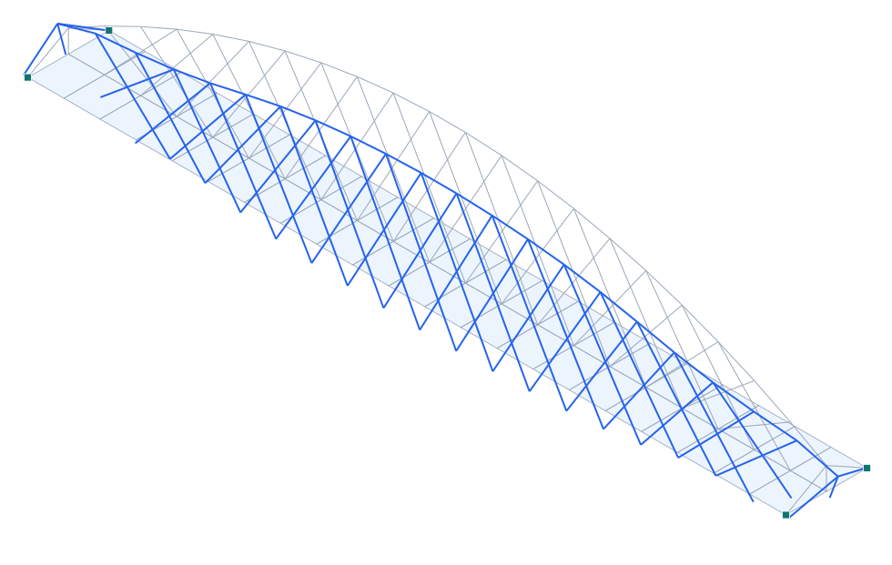

# Puente de la Barqueta (Sevilla, 1992) — arco con red de péndolas y tablero de áreas

**Tipo:** ejemplo 3D con **geometría real** y **tablero modelado con elementos de área (shell)** · **Modelo:** [`examples/puente_barqueta.s3d`](../../examples/puente_barqueta.s3d)

## Descripción

El **Puente de la Barqueta** (Sevilla, Juan José Arenas y Marcos J. Pantaleón, Expo'92) salva el Guadalquivir con **un solo vano de 168 m**. Es un **arco atirantado** con **un único arco central** del que cuelga el tablero mediante una **red de péndolas inclinadas centradas** (los característicos tirantes rojos cruzados), y con **pórticos triangulares** en cada extremo (las «puertas») que recogen el arranque del arco. El tablero (mixto acero-hormigón) actúa además de **tirante**, cerrando el empuje del arco.

| Propiedad | Valor |
| --- | --- |
| Luz | 168 m (vano único) |
| Ancho del tablero (modelo) | 18 m |
| Arco | único, central, flecha ~24 m |
| Péndolas | red inclinada centrada (network) |
| Extremos | pórticos triangulares («puertas») |
| Tablero | elementos de ÁREA (shell), tirante |
| Autores / año | Arenas & Pantaleón / 1992 |

## Modelo en Pórtico

- El **tablero** se modela con **42 elementos de área (QUAD shell)** — membrana (acción de tirante en su plano) + placa (flexión transversal). Es la novedad pedida: el tablero como áreas, no como viga.
- El **arco** central (plano longitudinal medio) es una cadena de elementos viga; los **pórticos triangulares** de extremo conectan el arranque del arco con las esquinas del tablero.
- La **red de péndolas** se arma con elementos inclinados **cruzados** (cada nodo del arco baja a nodos del eje del tablero desfasados ±2 → patrón network), reproduciendo los tirantes inclinados característicos.
- Apoyos en las **4 esquinas** del tablero (uno fijo en planta, los demás liberan la dilatación); el tablero-tirante absorbe el **empuje** del arco.

*Figura. Vista 3D: tablero (áreas), arco central, pórticos triangulares y red de péndolas, con la deformada (×escala) bajo peso propio + carga de tablero.*

## Resultados (peso propio + carga de tablero 12 kN/m²)

| Magnitud | Valor |
| --- | --- |
| Nodos · elementos · áreas | 88 · 63 · 42 |
| ΣReacciones verticales | 36513 kN |
| Desplazamiento máx. |u| | 200.2 mm |
| Axial máx. |N| (arco/tirante) | 27909 kN |

## Conclusión

El modelo reproduce la **forma real** de la Barqueta —arco único central, **red de péndolas inclinadas centradas** y pórticos triangulares de extremo— con el **tablero modelado por elementos de área (shell)** que trabaja de tirante. Resuelve en equilibrio bajo peso propio + carga de tablero. Ejemplo avanzado que combina **barras + áreas** en un puente real. *(El cálculo riguroso de las péndolas usa el análisis geométrico/no lineal de Pórtico — Kg/NL-lite.)*
