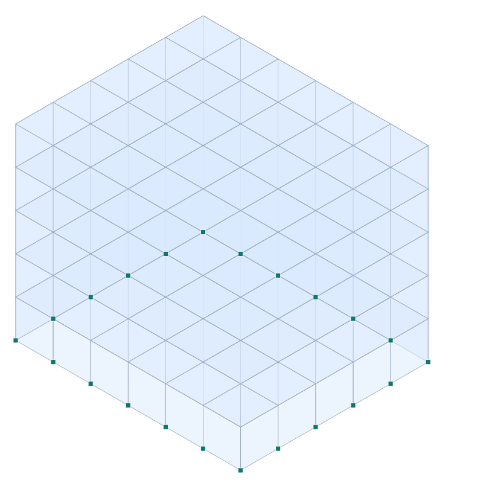

# Tutorial 2 — Edificio de 5 pisos de MUROS de hormigón en Valdivia (muros = membrana, losas = placa)

**Tipo:** tutorial de modelado con **elementos de área** · **Modelo:** [`examples/tutorial_edificio_muros_valdivia.s3d`](../../examples/tutorial_edificio_muros_valdivia.s3d)
**Normas:** NCh433 + DS61 (sísmico), NCh1537 (cargas).

> ⚠️ Tutorial educativo. Confirmar zona/suelo para el sitio (Valdivia: suelos blandos; ver el tutorial de pórticos). Muros modelados **sin aberturas** (puertas/ventanas) por simplicidad.

## 1. Objetivo

Variante del edificio de Valdivia resuelto con **muros de corte** en vez de pórticos: los **muros** se modelan con **elementos MEMBRANA/shell** (rigidez en su plano = corte + axial) y las **losas de entrepiso** con **elementos PLACA/shell** (flexión + acción de diafragma). Ilustra el uso de elementos de área para estructuras de muros.

## 2. Geometría y modelo

- Planta **18×15 m**, **5 pisos** de 3 m. Muros en el **perímetro** (4 caras), losa en cada piso.
- **Muros** (110 paneles shell, t=0.25 m): paneles verticales entre niveles → rigidez de **corte** en su plano.
- **Losas** (150 paneles shell, t=0.2 m): malla horizontal por piso → **flexión** vertical + **diafragma** en su plano.
- Base: nodos de arranque de los muros **empotrados**. Modelo: **232 nodos**, **260 elementos de área**.

*Figura. Edificio de muros (paneles) y su **primer modo** (×escala).*

## 3. Materiales, cargas y masa

- Hormigón H30 (E=2.57·10⁷ kPa). Espesores: muros 0.25 m, losas 0.2 m.
- **Masa sísmica:** peso propio de muros y losas (las áreas aportan ρ·t·A al modal automáticamente) **más** la sobrecarga (D_sup + 0.25·L) = (3.0+0.25·2.0) kN/m² aplicada como **masa nodal** por área tributaria (total adicional 1514 ton).

## 4. Análisis modal (Pórtico, con elementos de área)

| Modo | T [s] | f [Hz] | % masa X | % masa Y |
| --- | --- | --- | --- | --- |
| 1 | 0.086 | 11.66 | 0.0 | 83.7 |
| 2 | 0.077 | 13.04 | 84.3 | 0.0 |
| 3 | 0.043 | 23.52 | 0.0 | 0.0 |
| 4 | 0.028 | 35.11 | 0.0 | 12.4 |
| 5 | 0.026 | 39.06 | 11.9 | 0.0 |
| 6 | 0.017 | 59.71 | 0.0 | 2.9 |

**Período fundamental T₁ = 0.086 s.** Un edificio de muros es **mucho más rígido** que el de pórticos (período más corto) → mayor aceleración espectral pero menores derivas.

## 5. Espectro de diseño NCh433/DS61 (Zona 2, Suelo D)

$$ S_a(T)=\frac{S\,A_0\,\alpha(T)}{R^*} $$

| T [s] | Sa(T) [g] |
| --- | --- |
| 0.100 | 0.262 |
| 0.200 | 0.247 |
| 0.086 | 0.267 |
| 0.500 | 0.216 |

Para T₁ = 0.077 s → **Sa = 0.271 g** (espectro de diseño con R*=1.94).

## 6. Comentarios de diseño

- Los **muros** concentran la rigidez lateral; las **losas-diafragma** reparten la fuerza sísmica entre muros. Verificar **tensiones de von Mises** en los muros (postproceso de áreas de Pórtico) y el **corte** en la base de cada muro.
- En Pórtico el contorno de tensiones de áreas y el panel de cada elemento entregan σ de membrana/superficie; las combinaciones NCh3171 y la memoria `.docx` documentan el diseño.

## 7. Conclusión

El edificio de **muros (membrana) + losas (placa)** modela como un conjunto de elementos de área; el modal entrega T₁ = 0.086 s (mucho más rígido que el de pórticos, T₁≈0.65 s) y el espectro NCh433/DS61 da la demanda. Demuestra el uso de **elementos de área para muros de corte y losas de entrepiso** en Pórtico. *(Modelo sin aberturas; el análisis real incluye huecos, acoplamiento de muros y verificación de tensiones.)*
