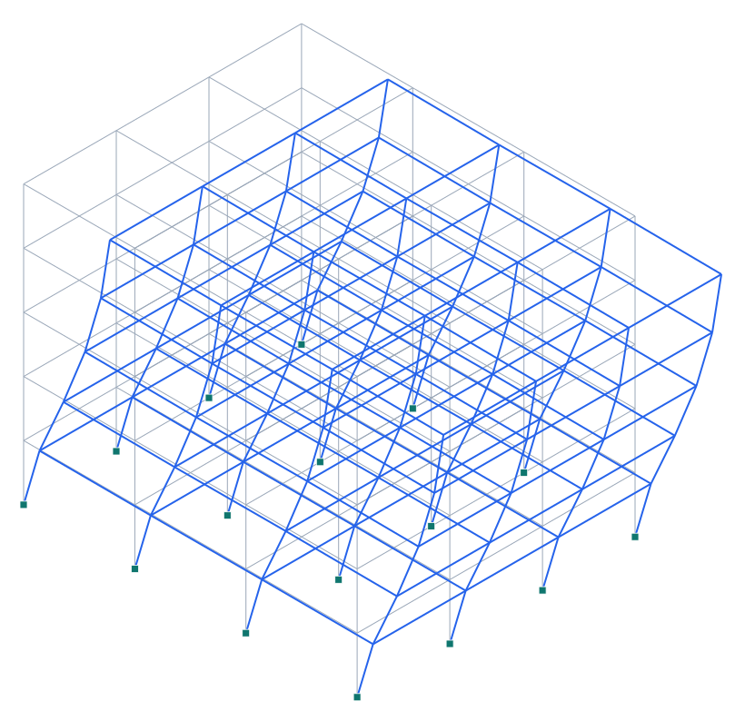

# Tutorial — Edificio de 5 pisos de hormigón armado en Valdivia

**Tipo:** tutorial paso a paso (modelado + análisis sísmico en Pórtico).
**Modelo:** [`examples/tutorial_edificio_valdivia.s3d`](../../examples/tutorial_edificio_valdivia.s3d)
**Normas:** NCh433 (diseño sísmico) + DS61, NCh1537 (cargas), NCh3171 (combinaciones).

> ⚠️ **Tutorial educativo.** Los valores de zona sísmica y tipo de suelo deben confirmarse para el sitio y la comuna exactos según la versión vigente de NCh433 (existe la actualización **NCh433:2026**). Valdivia tiene **suelos blandos** (depósitos fluviales; el terremoto de 1960 produjo subsidencia/licuefacción): el tipo de suelo lo define la **mecánica de suelos** del proyecto; partes de la ciudad pueden ser **D, E o incluso F (estudio especial)**.

## 1. Objetivo y alcance

Modelar y analizar sísmicamente un **edificio de 5 pisos de hormigón armado** (pórticos espaciales con losas rígidas) emplazado en **Valdivia**, ilustrando el flujo completo en Pórtico: geometría → materiales/secciones → cargas → masas sísmicas → diafragmas → **modal** → **espectro de respuesta** (NCh433/DS61) → cortes basales → derivas → diseño.

## 2. Antecedentes del sitio (Valdivia)

| Parámetro | Valor | Fuente |
| --- | --- | --- |
| Zona sísmica | Zona 2 | NCh433 (zonificación por comuna) |
| Aceleración efectiva A₀ | 0.30·g | NCh433 (Zona 2) |
| Tipo de suelo (asumido) | D | mecánica de suelos (confirmar; Valdivia suele D/E/F) |
| Categoría / importancia I | II / I=1.0 | NCh433 (vivienda-oficina) |
| R / R₀ | 7 / 11 | NCh433 Tabla 5.1 (H.A.) |

## 3. Geometría y modelo en Pórtico

- Planta **3×3 vanos** (6 m en X, 5 m en Y → 18×15 m), **5 pisos** de **3.0 m** (altura total 15.0 m). La planta **rectangular** separa los períodos en X e Y (modos limpios).
- **Paso a paso en Pórtico:** (1) crear la grilla (ejes cada 6 m en X y 5 m en Y, niveles cada 3.0 m); (2) modo **Elemento** → columnas verticales y vigas en X e Y por piso (el imán reutiliza nodos); (3) modo **Apoyo** → empotrar los 16 nodos de la base; (4) Análisis → **autodetectar diafragmas** (crea un diafragma rígido por piso en su centro de rigidez).
- El modelo resultante: **96 nodos**, **200 elementos**, **5 diafragmas**.

*Figura. Pórtico 3D del edificio y su **primer modo** de vibración (×escala).*

## 4. Materiales y secciones

| Elemento | Sección | Propiedades |
| --- | --- | --- |
| Material | Hormigón H30 | E = 4700√f'c = 2.57·10⁷ kPa, ν=0.2 |
| Columnas | 50×50 cm | A=0.25 m², I=5.21·10⁻³ m⁴ |
| Vigas | 30×60 cm | A=0.18 m², I_z=5.40·10⁻³ m⁴ |

*En Pórtico se pueden aplicar **modificadores de rigidez** (sección agrietada ACI: vigas 0.35·Ig, columnas 0.70·Ig) en `sec.mod`.*

## 5. Cargas y masa sísmica (NCh1537 / NCh433)

- Carga muerta **D = 6.0 kN/m²** (losa + terminaciones + tabiquería), sobrecarga **L = 2.0 kN/m²**.
- **Peso sísmico** por piso = (D + 0.25·L)·A = (6.0+0.25·2.0)·270 = **1755 kN** → masa **178.9 ton/piso**.
- **Peso sísmico total P = 8775 kN**. La masa se asigna al **diafragma** de cada piso (Pórtico la reparte por área tributaria y arma la inercia rotacional).

## 6. Espectro de diseño NCh433 + DS61

Parámetros del suelo **D** (DS61): S=1.20, T₀=0.75 s, T'=0.85 s, n=1.80, p=1.0.

$$ S_a(T) = \frac{S\,A_0\,\alpha(T)}{R^*},\quad \alpha(T)=\frac{1+4.5(T/T_0)^p}{1+(T/T_0)^3},\quad R^*=1+\frac{T}{0.10\,T_0 + T/R_0} $$

| T [s] | α(T) | R*(T) | Sa(T) [g] |
| --- | --- | --- | --- |
| 0.2 | 2.16 | 3.15 | 0.247 |
| 0.5 | 3.09 | 5.15 | 0.216 |
| 1.0 | 2.08 | 7.03 | 0.106 |
| 1.5 | 1.11 | 8.10 | 0.049 |
| 2.0 | 0.65 | 8.79 | 0.027 |

## 7. Análisis modal (resultados de Pórtico)

Corrido con la **iteración de subespacio** (6 modos). Períodos y participación de masa:

| Modo | T [s] | f [Hz] | % masa X | % masa Y |
| --- | --- | --- | --- | --- |
| 1 | 0.648 | 1.54 | 81.5 | 0.4 |
| 2 | 0.620 | 1.61 | 0.4 | 81.8 |
| 3 | 0.543 | 1.84 | 0.0 | 0.0 |
| 4 | 0.204 | 4.90 | 10.4 | 0.1 |
| 5 | 0.197 | 5.09 | 0.1 | 10.4 |
| 6 | 0.172 | 5.80 | 0.0 | 0.0 |

**Período fundamental T₁ = 0.648 s.** Modo dominante en X: modo 1 (T = 0.648 s, 81.5 % de masa).

## 8. Análisis sísmico — corte basal

| Magnitud | Valor | Comentario |
| --- | --- | --- |
| Sa(T₁) de diseño | 0.183 g | espectro DS61 en el modo dominante |
| Corte basal espectral Q (≈ modo dom.) | 1607 kN | Sa·P (estimación del modo dominante) |
| Coef. sísmico estático C | 0.230 | 2.75·A₀·S/R·(T'/T*)ⁿ acotado |
| Corte basal estático Q₀ | 2021 kN | C·I·P |
| Corte basal mínimo | 527 kN | A₀·S/6·I·P (cota inferior NCh433) |

> El análisis de **espectro de respuesta** real (combinación **CQC** de todos los modos) se ejecuta en Pórtico desde el Centro de análisis (caso espectral X/Y); el corte basal modal se **escala al mínimo** de NCh433 si resulta menor. La tabla anterior usa el modo dominante como referencia.

## 9. Derivas de entrepiso

NCh433 limita la **deriva de entrepiso** a **0.002·h** (entre centros de masa, con desplazamientos del análisis ×R₀ o según el método). Estimación con el modo dominante:

| Magnitud | Valor |
| --- | --- |
| Desplazamiento espectral Sd (modo dom.) | 19.1 mm |
| Desplazamiento de techo (aprox.) | 24.4 mm |
| Deriva media de entrepiso (aprox.) | 1.62 ‰ (límite 2 ‰ = 0.002) |

*Estimación del modo dominante; la verificación formal usa las derivas por piso del análisis espectral (CQC) en Pórtico.*

## 10. Combinaciones y diseño

- Combinaciones **NCh3171/ASCE-7** (Pórtico las crea automáticamente): 1.4D; 1.2D+1.6L; 1.2D+L±1.4E_x; 1.2D+L±1.4E_y; 0.9D±1.4E. Set ASD opcional.
- Con los esfuerzos por combinación, la **tabla de diseño** de Pórtico entrega D/C por elemento; la **memoria de cálculo** (.docx) documenta bases, modal, cortes, derivas y diseño.

## 11. Conclusión y limitaciones

El edificio de 5 pisos modela como **pórtico espacial de H.A. con diafragmas rígidos**; el modal entrega T₁ = 0.648 s y participaciones coherentes, y el espectro NCh433/DS61 (Zona 2, Suelo D) da los cortes basales y derivas de diseño. **Limitaciones:** los valores de zona/suelo deben confirmarse para el sitio (Valdivia: suelos blandos, posible D/E/F con estudio especial); las derivas y el corte mostrados son estimaciones del modo dominante — la verificación final usa el **espectro de respuesta CQC** y las combinaciones en Pórtico.
