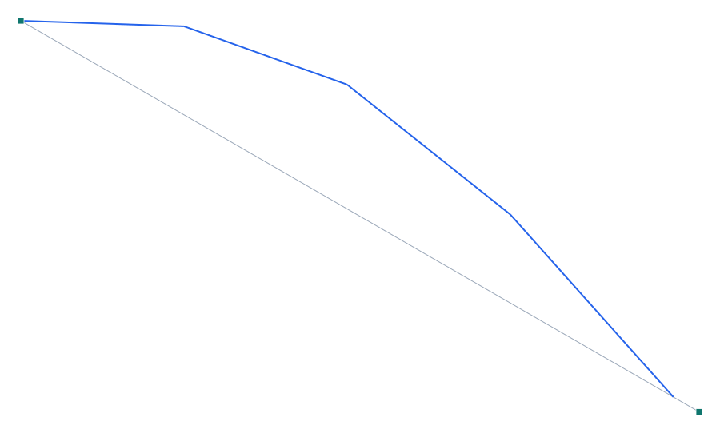

# Verificación 1-009 — Pretensado por tendón parabólico — balanceo de carga

**Capacidad verificada:** pretensado por tendones con trazado parabólico → cargas equivalentes (load balancing) y axial de presfuerzo.
**Referencia:** Método de las cargas equivalentes / balanceo de carga (T.Y. Lin, *Design of Prestressed Concrete Structures*); solución de viga simplemente apoyada.
**Modelo Pórtico:** [`examples/verif_1-009_pretensado.s3d`](../../examples/verif_1-009_pretensado.s3d)

## Descripción del problema

Viga simplemente apoyada de 20 m (4 elementos) con un **tendón parabólico** de fuerza efectiva P = 2000 kN y **sagita a = 0.4 m** al centro (anclado en el centroide en los extremos). Por el método de las **cargas equivalentes**, el tendón ejerce sobre el hormigón una carga uniforme hacia **arriba** w = 8·P·a/L² = **16 kN/m** y una **compresión axial uniforme** P. Se verifica la **contraflecha** de centro (5wL⁴/384EI) y el **axial** de presfuerzo.

| Propiedad | Valor |
| --- | --- |
| Luz | L = 20 m (4 × 5 m) |
| Fuerza del tendón | P = 2000 kN (efectiva) |
| Trazado | parábola, sagita a = 0.4 m (e=0 en anclas) |
| E | 3.0·10⁷ kN/m² |
| I | 0.1 m⁴ |
| Carga equivalente | w = 8Pa/L² = 16 kN/m (↑) |

## Modelo en Pórtico

- Modelo **2D**, viga simple (articulada + rodillo); peso propio desactivado para aislar el presfuerzo.
- El tendón se traduce a **cargas equivalentes** (UDL hacia arriba + axial de ancla) con `tendonEquivalentLoads`, que el estático lineal resuelve normalmente.
- La **contraflecha** (hacia arriba) confirma el signo y la magnitud de la carga equivalente; el **axial** confirma la compresión uniforme de presfuerzo.

*Figura 1. Deformada bajo el solo pretensado (×escala): la viga se arquea hacia ARRIBA (contraflecha), efecto característico del tendón parabólico.*

## Resultados — comparación

Sólo el pretensado actuando (sin carga externa). Contraflecha del centro y axial del primer elemento.

| Cantidad | Descripción | Independiente (—) | SAP2000 (—) | dif. SAP | **Pórtico (—)** | **dif. Pórtico** |
| --- | --- | --- | --- | --- | --- | --- |
| 1 | Contraflecha de centro, nodo 3 · U_z [m] (↑) | 0.01111 | 0.01111 | 0 % | **0.01111** | **+0.01 %** |
| 2 | Axial de presfuerzo, elem 1 · N [kN] (− = compresión) | -2000.00000 | -2000.00000 | 0 % | **-2000.00000** | **0 %** |

### Balanceo de carga (load balancing)

La esencia del método: si se añade una carga externa **descendente** de 16 kN/m (igual a la equivalente del tendón), la flecha neta de la viga es **≈ 0** — el pretensado «balancea» exactamente la carga, dejando sólo una compresión axial uniforme. Esta propiedad está verificada en `test_tendon.mjs` (flecha neta < 10⁻⁴·contraflecha).

**Verificación analítica:** w = 8Pa/L² = 8·2000·0.4/20² = **16 kN/m**; contraflecha = 5wL⁴/(384EI) = 5·16·20⁴/(384·3·10⁶) = **0.01111 m**; axial = **−P = −2000 kN** (sin reacción horizontal, presfuerzo autoequilibrado).

## Conclusión

El módulo de pretensado reproduce con **0.0 %** de error la contraflecha de centro (0.01111 m hacia arriba) y el axial de presfuerzo (−2000 kN) del método de cargas equivalentes. El **balanceo de carga** queda confirmado (flecha neta nula al añadir la carga externa equivalente). **Capacidad de pretensado por tendones (#60) verificada.**
