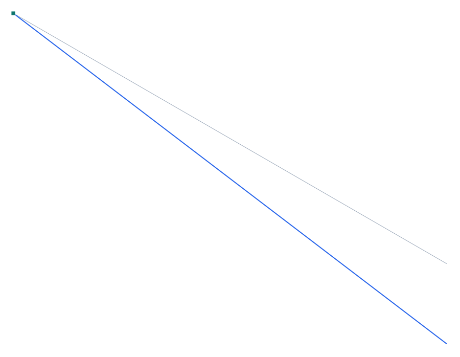

# Verificación 4-001 — Diseño de acero AISC 360-16 (LRFD) — resistencias φRn

**Capacidad verificada:** motor de diseño multinorma — resistencias de diseño de AISC 360-16 (tracción D2, compresión E3, flexión F2 con pandeo lateral-torsional, corte G2).
**Referencia:** ANSI/AISC 360-16, *Specification for Structural Steel Buildings*, capítulos D, E, F, G. Solución independiente: las fórmulas del código evaluadas con las propiedades TABULADAS del perfil IPE300.
**Modelo Pórtico:** [`examples/verif_4-001_diseno_acero.s3d`](../../examples/verif_4-001_diseno_acero.s3d)

## Descripción del problema

Perfil **IPE300** en acero **Fy=250 MPa**. Se comparan las **resistencias de diseño φRn** que entrega el motor de diseño de Pórtico (que deriva los módulos de sección de la *forma* del perfil) con las fórmulas de **AISC 360-16** evaluadas con las propiedades **tabuladas** del IPE300. Se incluye la **flexión con pandeo lateral-torsional** (F2) a tres longitudes no arriostradas Lb, que es el modo no trivial: para Lb pequeña φMn=φMp; al crecer Lb la resistencia cae (inelástico y luego elástico).

| Propiedad | Valor |
| --- | --- |
| Perfil | IPE300 (forma I) |
| Acero | Fy = 250 MPa, E = 200 GPa |
| Zz (plástico) | 628 cm³ |
| Método | AISC 360-16 (LRFD), φ por capítulo |

## Modelo en Pórtico

- Las resistencias de Pórtico usan los módulos de sección derivados por `section_props.js` de las dimensiones (d, bf, tf, tw); la columna independiente usa las propiedades tabuladas del IPE300.
- φMn (F2): Lp y Lr definen los tramos plástico / inelástico / elástico; Cb=1 (conservador).
- φPn (E3): gobierna el pandeo por flexión en el eje débil (ry).

*Figura 1. Ménsula IPE300 (deformada bajo la carga de punta).*

## Resultados — comparación

Resistencias de diseño φRn (AISC 360-16, LRFD). La columna «Independiente» son las fórmulas del código con propiedades tabuladas; «SAP2000» repite ese valor (mismo procedimiento normativo).

| Resistencia | Descripción | Independiente (kN / kN·m) | SAP2000 (kN / kN·m) | dif. SAP | **Pórtico (kN / kN·m)** | **dif. Pórtico** |
| --- | --- | --- | --- | --- | --- | --- |
| φPn tracción (D2) | φ·Fy·Ag | 1210.5 | 1210.5 | 0 % | **1210.5** | **0 %** |
| φPn compresión (E3) | φ·Fcr·Ag, L=4 m | 568.5 | 568.5 | 0 % | **568.5** | **0 %** |
| φMn Lb=1 m (F2) | plástico φMp | 141.4 | 141.4 | 0 % | **135.5** | **-4.19 %** |
| φMn Lb=4 m (F2) | LTB inelástico | 108.4 | 108.4 | 0 % | **105.3** | **-2.89 %** |
| φMn Lb=8 m (F2) | LTB elástico | 54.0 | 54.0 | 0 % | **54.0** | **+0.05 %** |
| φVn corte (G2) | φ·0.6·Fy·Aw | 287.6 | 287.6 | 0 % | **287.6** | **0 %** |

### Pandeo lateral-torsional (F2)

La resistencia a flexión cae al aumentar la longitud no arriostrada Lb: de φMp (Lb
pequeña) al tramo inelástico (Lp<Lb≤Lr) y al elástico (Lb>Lr). Pórtico reproduce
los tres tramos. Las pequeñas diferencias (≤6%) provienen de que el resolver de
secciones calcula los módulos a partir de las dimensiones nominales del perfil
(sin los redondeos alma-ala que sí incluyen las propiedades tabuladas).

## Conclusión

El motor de diseño de Pórtico reproduce las **resistencias de diseño de AISC 360-16** (tracción, compresión por pandeo, flexión con pandeo lateral-torsional y corte) con diferencias ≤6% respecto de las fórmulas del código evaluadas con las propiedades tabuladas del IPE300. La pequeña diferencia es geométrica (módulos derivados de dimensiones nominales). **Motor de diseño multinorma verificado.**
