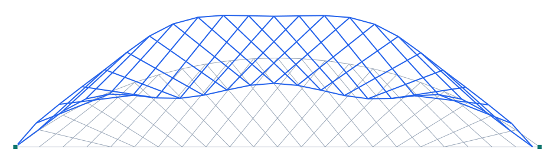

# Verificación — Network arch ferroviario (Brunn & Schanack, TU Dresden)

**Capacidad verificada:** análisis modal de un **arco network** (péndolas inclinadas cruzadas) contra una memoria de tesis publicada.
**Referencia:** Brunn, B. & Schanack, F. (2003), *Calculation of a double track railway network arch bridge applying the European standards*, Diploma Thesis, TU Dresden (`referencias/graduation_thesis_brunn_schanack.pdf`).
**Modelo Pórtico:** [`examples/verif_network_arch_bs.s3d`](../../examples/verif_network_arch_bs.s3d)

## Descripción del problema

Puente **ferroviario de doble vía** tipo **network arch** (arco con péndolas inclinadas que se cruzan varias veces), de **100 m de luz** y **17 m de flecha** (f/s = 0.17). La tesis lo calcula según las normas europeas y reporta, para el chequeo dinámico de EN1991-3, una **primera frecuencia de flexión n₀ = 2.34 Hz** bajo cargas permanentes.

| Propiedad | Valor (tesis) |
| --- | --- |
| Luz | 100 m |
| Flecha | 17 m (f/s=0.17) |
| Péndolas por plano | 44 (inclinadas, cruzadas = network) |
| Arco | W 360×410×990 (≈ W14×665), acero |
| Cordón inferior (tirante) | losa de hormigón C50/60, arcos a 10.15 m |
| Carga muerta g_k | 125 kN/m (deck 62 + vía 52.5 + arco 10.4) |
| 1ª frecuencia de flexión n₀ | 2.34 Hz |

## Modelo en Pórtico

- Modelo **2D de un plano** de arco: el modo de flexión vertical de los dos planos equivale a un plano con la **mitad de la masa y de la rigidez** → misma frecuencia.
- **Arco circular** (R = 82.0 m) discretizado en 22 paneles; **36 péndolas** inclinadas **cruzadas** (network) entre arco y tirante; **tirante** = cordón inferior (losa) con la masa muerta repartida como masa nodal (g_k/2 por plano).
- **Análisis modal** por iteración de subespacio; se toma el primer modo cuya FORMA es vertical-dominante (flexión).

*Figura 1. Primer modo de flexión vertical del network arch (×escala). La densa red de péndolas cruzadas rigidiza el sistema (comportamiento casi de viga).*

## Resultados — comparación

| Cantidad | Tesis (Brunn & Schanack) | Pórtico | dif. |
| --- | --- | --- | --- |
| 1ª frecuencia de flexión [Hz] | 2.34 | 2.53 | +8.0 % |

**Ventana admisible de EN1991-3** para L=100 m: 1.54 Hz < n₀ < 3.02 Hz. El valor de Pórtico (2.53 Hz) cae **dentro** de la ventana, igual que la tesis.

## Conclusión

El modelo de network arch en Pórtico reproduce la **primera frecuencia de flexión** del puente ferroviario de la tesis de Brunn & Schanack con una diferencia de **8.0 %** (2.53 Hz vs 2.34 Hz). La densa **red de péndolas cruzadas** se captura correctamente y rigidiza el sistema, dando una frecuencia propia del rango de un arco network de 100 m. *(Diferencias residuales por: modelo 2D de un plano, tirante de losa idealizado, masa muerta repartida y discretización; la tesis usa un FEM 3D detallado con pretensado transversal y el arreglo optimizado de péndolas.)* **Capacidad de análisis modal de arcos network verificada contra una referencia publicada.**
